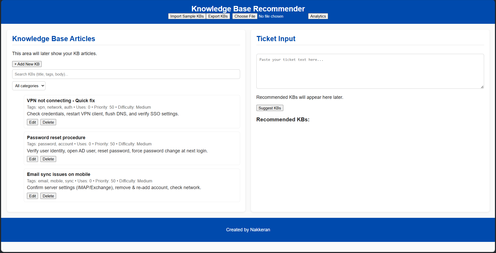

# Knowledge Base Recommendation Tool

## Overview
A web-based tool designed to recommend relevant knowledge base articles
to service desk agents for faster and more consistent ticket resolution.

## Problem Statement
Service desk agents spend time searching for the correct KB articles,
leading to longer resolution times and inconsistent responses.

## Solution
This tool suggests relevant KB articles based on keyword matching and
usage patterns, helping agents resolve tickets more efficiently.

## Features
- Keyword-based knowledge article recommendations
- Simple, lightweight UI
- Client-side logic using JavaScript

## Tech Stack
- HTML
- CSS
- JavaScript

## How to Run
1. Clone the repository
2. Open `index.html` in a browser

## Future Enhancements
- Machine learning integration for advanced pattern recognition
- Team-wide knowledge sharing capabilities
- Integration with existing ticketing systems
- Mobile application development
- Advanced analytics and reporting features

## Screenshots

### Home Screen

### Sample Recommendation Output

