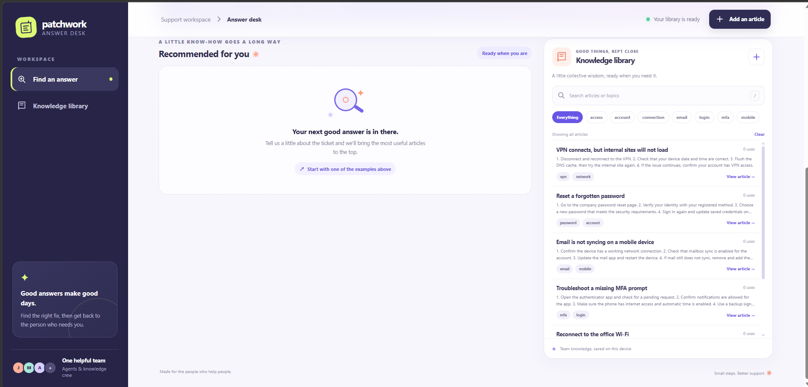

# Patchwork — Knowledge Base Recommender

A friendly, browser-based workspace for finding useful support articles and sharing team know-how.

## Preview

The library starts with the recommendation area ready for a ticket. Results appear after you submit an issue description.

## What it does

- Recommends up to four knowledge articles from a ticket description using transparent keyword matching.
- Searches and filters the article library by topic.
- Copies resolution steps into a reply and tracks article use on this device.
- Lets knowledge managers add articles without leaving the workspace.
- Starts with a small sample library so the experience is ready to explore.

## Run it

Open index.html in a modern browser. No build step or external service is required.

Articles and usage counts are saved in the browser's local storage on that device. The sample content is there to demonstrate the workflow; add your team's approved guidance before using it for real support.

